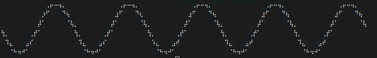

drawille
========
[](https://travis-ci.org/yamadapc/haskell-drawille)
[](https://gitter.im/yamadapc/haskell-drawille?utm_source=badge&utm_medium=badge&utm_campaign=pr-badge)
- - -

A tiny library to write to the terminal using Braille characters, a port of
[Adam Tauber's (asciimoo) work on python drawille](https://github.com/asciimoo/drawille)
to haskell.



The implementation still has some quirks, but it works (and is efficient).

## Installing

This package is available on hackage as
[`drawille`](http://hackage.haskell.org/package/drawille). You may install it
with cabal with:
```
cabal install drawille
```

## Documentation

The haddock documentation is available in
[hackage](http://hackage.haskell.org/package/drawille) or at
[our github pages website](https://yamadapc.github.io/haskell-drawille/),
to which it is deployed continously with Travis CI

## How to run tests

```
cabal configure --enable-tests && cabal build && cabal test
```

## License

This code is licensed under the GPL3 license. See [LICENSE](LICENSE) for more
information.
