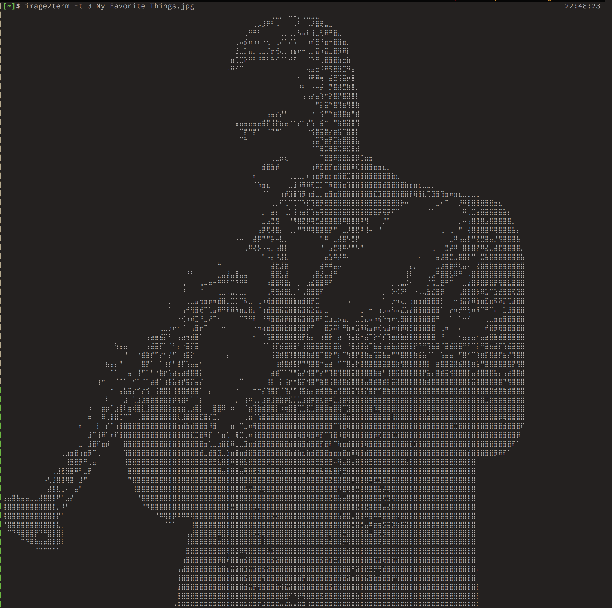

drawille
========
[](https://hackage.haskell.org/package/drawille)
[](http://packdeps.haskellers.com/feed?needle=drawille)
- - -

A tiny library to write to the terminal using Braille characters, a port of
[Adam Tauber's (asciimoo) work on python drawille](https://github.com/asciimoo/drawille)
to haskell.


The implementation still has some quirks, but it works (and is efficient).

## Installing

This package is available on hackage as
[`drawille`](http://hackage.haskell.org/package/drawille). You may install it
with cabal with:
```
cabal install drawille
```

## Documentation

The haddock documentation is available in
[hackage](http://hackage.haskell.org/package/drawille) or at
[our github pages website](https://yamadapc.github.io/haskell-drawille/),
to which it is deployed continously with Travis CI

## Examples

To compile the examples, use the flag `examples`, with:
```
cabal install drawille -fexamples
```

### `image2term`
Converts an image into a drawille canvas and displays the result on the screen.


## How to run tests
```
cabal configure --enable-tests && cabal build && cabal test
```

## License

This code is licensed under the GPL3 license. See [LICENSE](LICENSE) for more
information.

## Donations
Would you like to buy me a beer? Send bitcoin to 3JjxJydvoJjTrhLL86LGMc8cNB16pTAF3y
